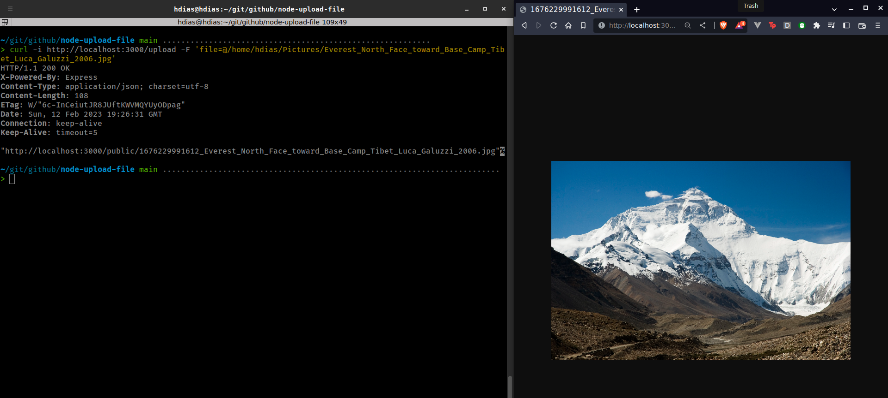

# node-upload-file
Uploading file with node and multer

Using the [Tutorial](https://www.youtube.com/watch?v=o5JoNi8z6q0)

# Requimerements
1. docker
2. docker-compose

# RUN
```sh
docker-compose up
# Wait the service get up and running
# Execute
#curl -i http://localhost:3000/upload -F 'file=@FULL_FILE_PATH'
curl -i http://localhost:3000/upload -F 'file=@/home/hdias/Pictures/Everest_North_Face_toward_Base_Camp_Tibet_Luca_Galuzzi_2006.jpg'
```
> You should receive a response with status 200 and the file url
> 

# References
* [Tutorial](https://www.youtube.com/watch?v=o5JoNi8z6q0)
* https://medium.com/@petehouston/upload-files-with-curl-93064dcccc76